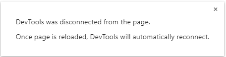

# prototype-proxy-get-receriver

如果将 Rroxy 实例设置为原型链，且配置了 handler.get 的 receiver 参数，那么将网页直接崩溃

* 错误信息



* 错误代码示例

```js
// 这段代码的由来：为了验证 handler.set 的 receiver 参数，突发奇想下想验证下 handler.get 的 receiver
let b = Object.create(new Proxy({}, {
  get(target, prop, receiver) {
    console.log(receiver)
    return target[prop]
  }
}))
```