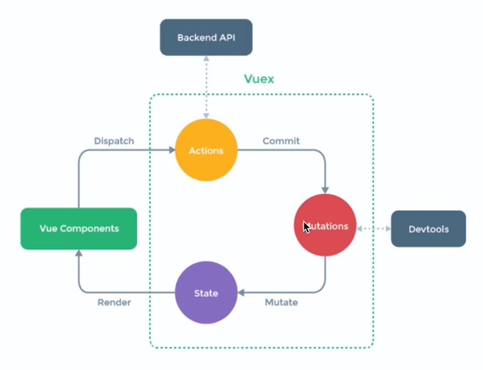

## 组件数据共用（Vuex）

#### vuex 交互流程图



#### 安装```Vuex```

```
npm install vuex --save
```

#### 定义规则：```/src/store.js```

```javascript
import Vue from 'vue'
import Vuex from 'vuex'

Vue.use(Vuex)

const state = {
  count: 1
};

const mutations = {
  increment(state) {
    state.count++
  },
  decrement(state) {
    state.count--
  }
}

const actions = {
  increment: ({commit}) => {
    
    // 对应 mutations 中的 increment
    commit('increment')
    
  },
  decrement: ({commit}) => {
    
    // 对应 mutations 中的 decrement
    commit('decrement')
    
  }
}

export default new Vuex.Store({state, actions, mutations})
```

#### 设置入口文件：```/src/main.js```

```javascript
import Vue from 'vue'
import App from './App.vue'
import store from './store.js'

Vue.config.productionTip = false

new Vue({
  render: h => h(App),
  store
}).$mount('#app')
```

#### 组件引用

```html
<template>
  <div>
    <div class="number">
      
      <!-- 数据展示 -->
      {{$store.state.count}}
      
    </div>
    <div class="btn">
      <button @click="increment">increment</button>
      <button @click="decrement">decrement</button>
    </div>
  </div>
</template>

<script>
  import {mapActions} from 'vuex'
  export default {
    name: 'crements',
    // 可以理解为方法映射：将组件中的方法名与actions中的方法名相关联
    methods: mapActions(['increment', 'decrement'])
  }
</script>
```

## ```vuex```模块化开发

#### 添加模块```/src/store/modules/layer.js``` ```/src/store/modules/tree.js```

```javascript
const state = {
  count: 1
};

const mutations = {
  increment(state) {
    state.count++
  },
  decrement(state) {
    state.count--
  }
}

const actions = {
  increment: ({commit}) => {
    commit('increment')
  },
  decrement: ({commit}) => {
    commit('decrement')
  }
}

export default {
  namespaced: true,
  state,
  mutations,
  actions
}
```

#### 模块汇总```/src/store/index.js```

```javascript
import Vue from 'vue'
import Vuex from 'vuex'
import layer from './modules/layer'
import tree from './modules/tree'

Vue.use(Vuex)

export default new Vuex.Store({
  modules: {
    layer,
    tree
  }
})
```

#### 设置入口文件```/main.js```

```javascript
import Vue from 'vue'
import App from './App.vue'
// 就这里存在差异
import store from './store/index.js'

Vue.config.productionTip = false

new Vue({
  render: h => h(App),
  store
}).$mount('#app')
```

#### 组件引用

```html
<template>
  <div>
    <div class="number">
      
      <!-- 数据展示。$store：挂载的对象；state：保存的数据；tree：模块名；count：模块下的数据 -->
      {{$store.state.tree.count}}
      
    </div>
    <div class="btn">
      <button @click="increment">increment</button>
      <button @click="decrement">decrement</button>
    </div>
  </div>
</template>

<script>
  import {mapActions} from 'vuex'
  
  export default {
    name: 'crements',
    // 可以理解为方法映射：将组件中的方法名与tree模块的actions中的方法名相关联
    methods: mapActions('tree', ['increment', 'decrement'])
  }
</script>
```


## vuex传参

#### 在组件中

```html
<button @click="increment(2)">increment</button>
```

#### 在模块文件中```/src/store/modules/tree.js```

```javascript
const mutations = {
  // 这里
  increment(state, param) {
    state.count+= param;
  },
  decrement(state) {
    state.count--
  }
}

const actions = {
  // 这里
  increment: ({commit}, param) => {
    commit('increment', param)
  },
  decrement: ({commit}) => {
    commit('decrement')
  }
}
```