## 基础图形

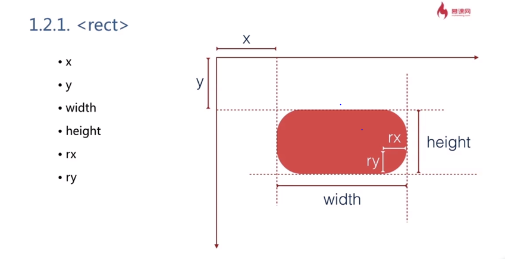
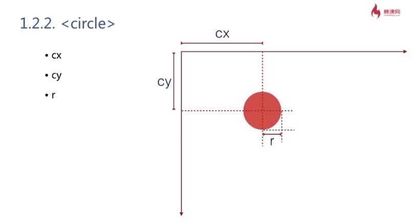
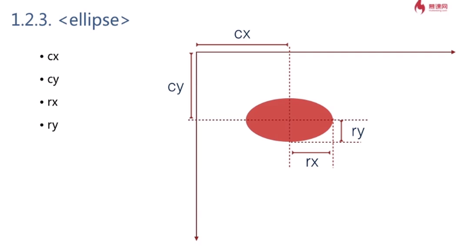
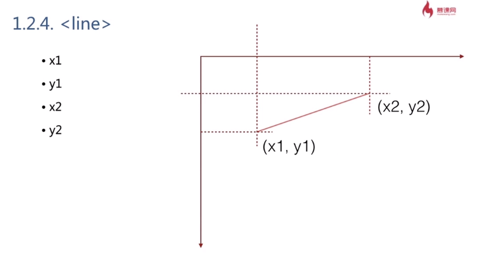
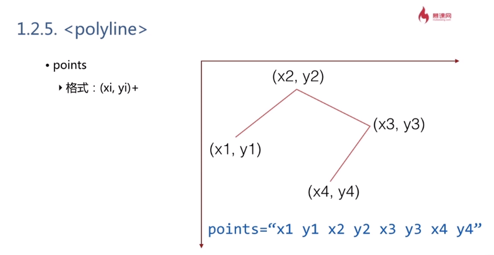
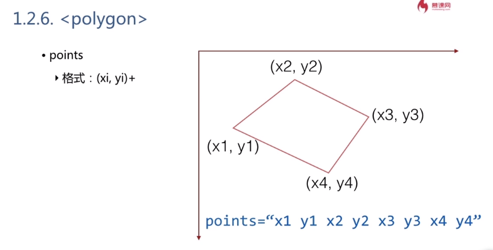


## 基础属性

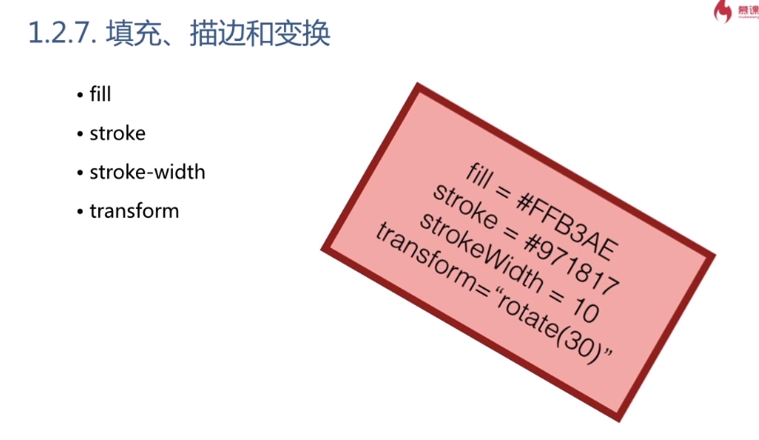


## 基本 API

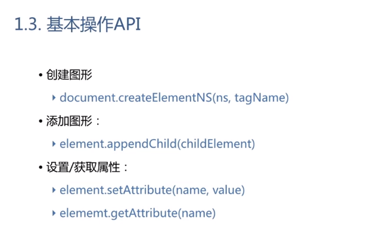


## 坐标系统

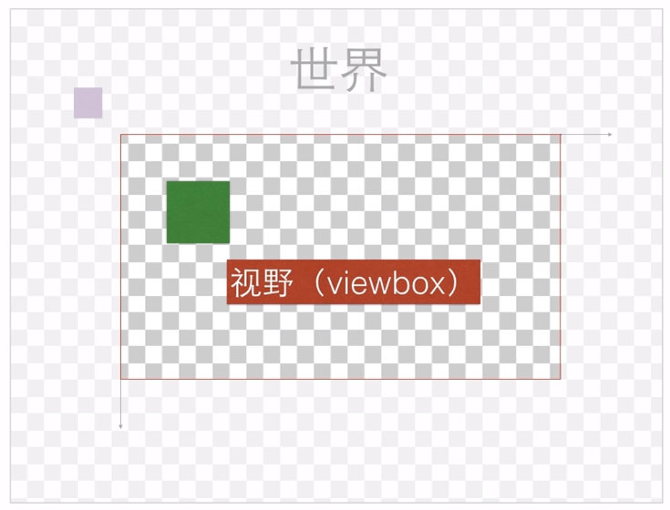


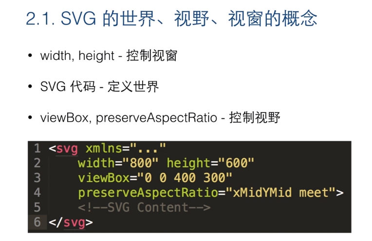


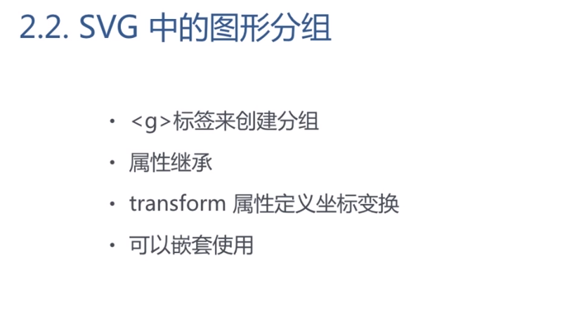

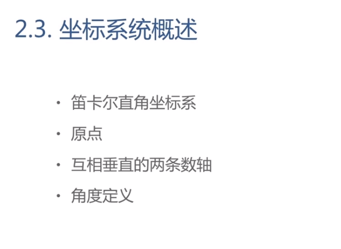

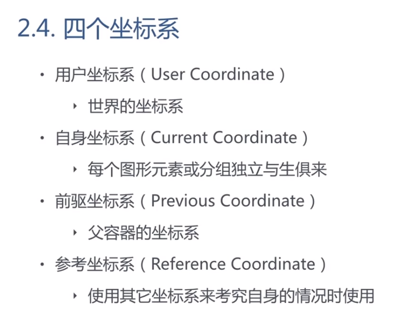

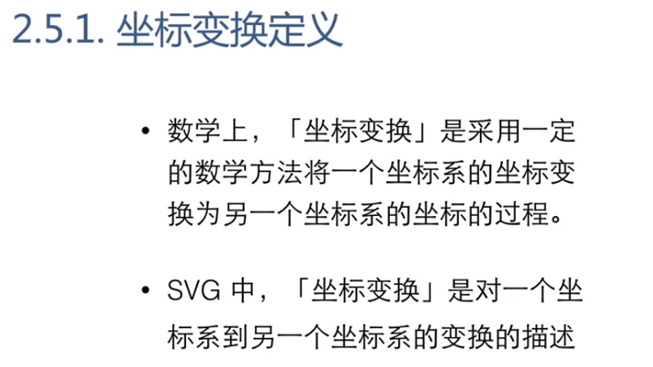

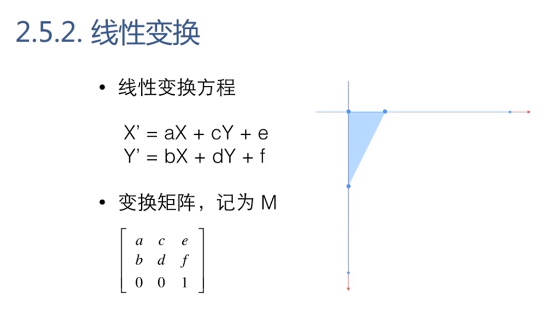

## RGB、HSL

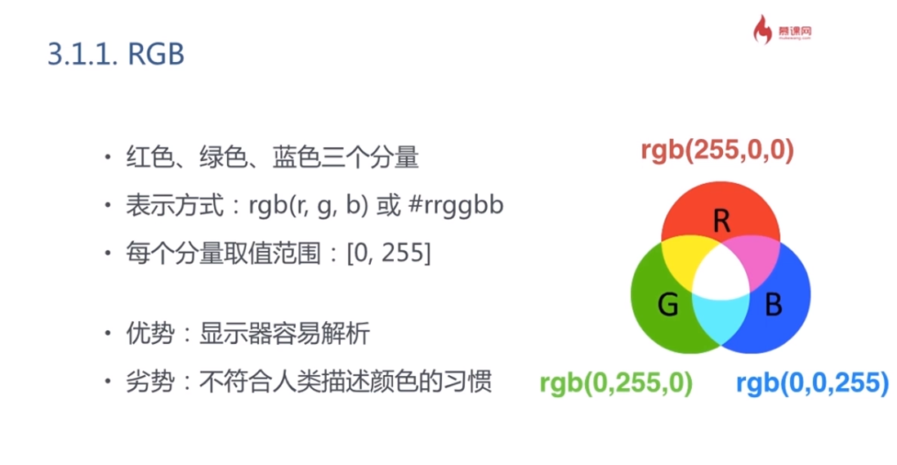

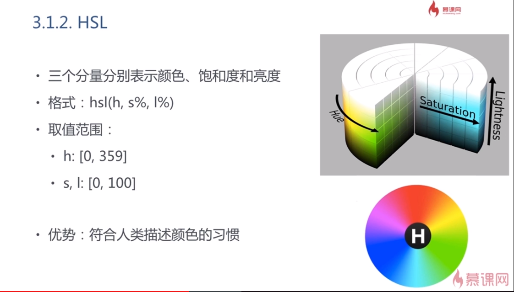

## 渐变

### 线性渐变

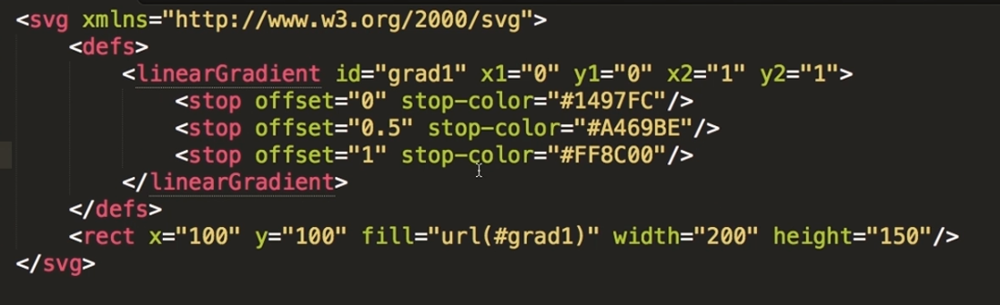

### 径向渐变

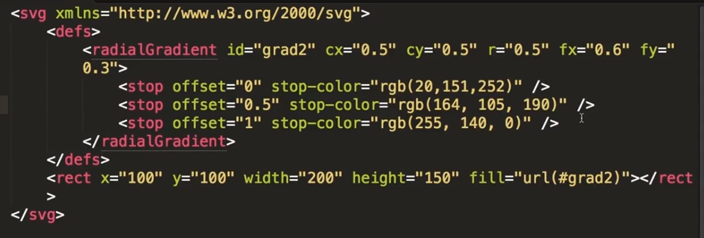


## 笔刷

* 绘制纹理
* `<pattern>` 标签
* `patternUnits` 和 `patternContentUnits`

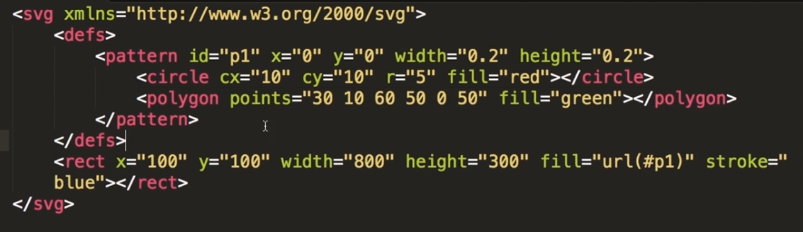


## path

```html
<!-- 等效写法 -->
<path d="M0,0L10,20C30-10,40,20,100,100" stroke="red"></path>
<path d="M 0 0 L 10 20 C 30 -10 40 20 100 100" stroke="red"></path>
<path d="M 0 0,L 10 20,C 30 -10 40 20 100 100" stroke="red"></path>
```

### path 命令

* 区分大小写：大写表示坐标参数为绝对位置，小写则为相对位置
* 最后的参数表示最终要到达的位置
* 上一个命令结束的位置为下一个命令的开始位置
* 命令可以重复参数表示重复执行一条命令

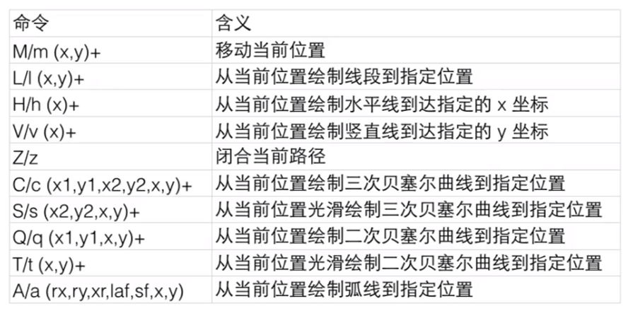

### 移动和直线命令

命令|说明
:-|:-
`M(x, y)+`|移动画笔。后面如果有重复参数，会当做 `L` 命令处理
`L(x, y)+`|绘制直线到指定位置
`H(x)+`|绘制水平直线到指定的 `x` 位置
`V(y)+`|绘制竖直直线到指定的 `y` 位置
`m`、`l`、`h`、`v`|使用相对位置绘制

### 弧线命令

> A(rx, ry, xr, laf, sf, x, y)

参数|说明
:-|:-
`rx`|`radius-x`：弧线所在椭圆的 `x` 半轴长
`ry`|`radius-y`：弧线所在椭圆的 `y` 半轴长
`xr`|`xAxis-rotation`：弧线所在椭圆的长轴角度
`laf`|`large-arc-flag`：是否选择弧长较长的那一段弧
`sf`|`sweep-flag`：是否选择逆时针方向的那一段弧
`x`、`y`|弧的终点位置

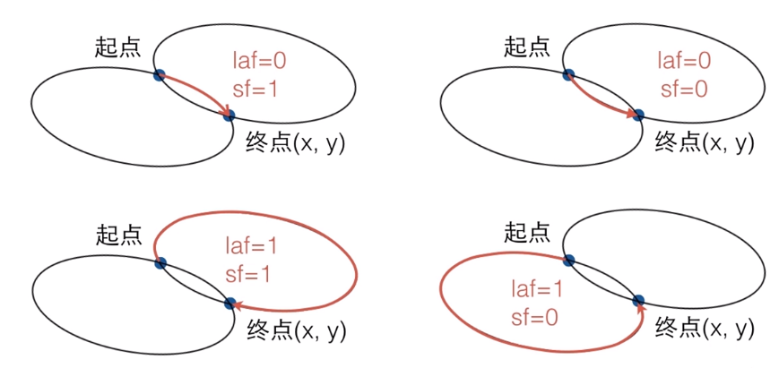

### 贝塞尔曲线命令

#### 二次贝塞尔曲线

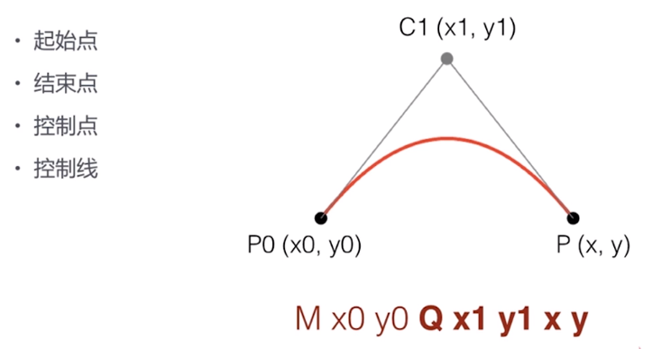

#### 三次贝塞尔曲线

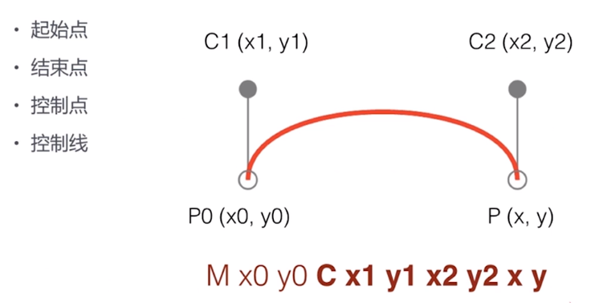

#### 光滑贝塞尔曲线

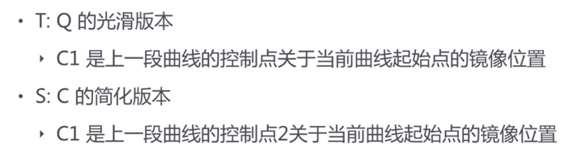


## SVG 文本

* `<text>` 和 `<tspan>` 创建文本
* 文字居中
  * 水平居中：text-anchor
  * 垂直居中：dominant-baseline
* `<textPath>` 文本路径
* `<a>` 超链接

### `<text>` 和 `<tspan>`

属性|说明
:-|:-
`x`、`y`|定位
`dx`、`dy`|字形偏移
`style`|样式

### `<textPath>`

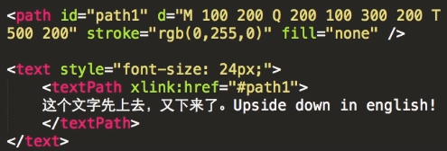

属性|说明
:-|:-
`x`、`text-anchor`、`startOffset`|确定起始位置
`dx`、`dy`|切线和发现方向的偏移

### `<a>`

* 可以添加到任意的图形上
* `xlink:href` 指定连接地址
* `xlink:title` 指定连接提示
* `target` 指定打开目标

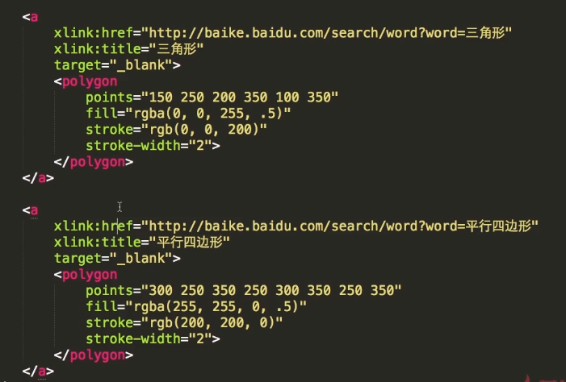


## 图形的引用、裁剪、蒙版

* `<use>` 标签创建图形引用
* `<clip>` 标签裁剪图形
* `<mask>` 标签创建蒙版


## 动画

### 基本动画

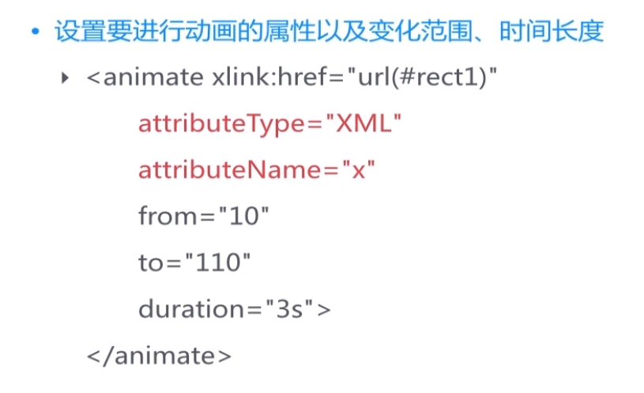

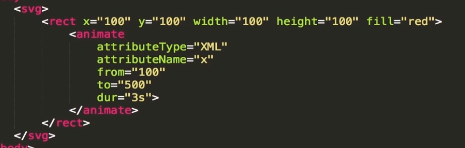